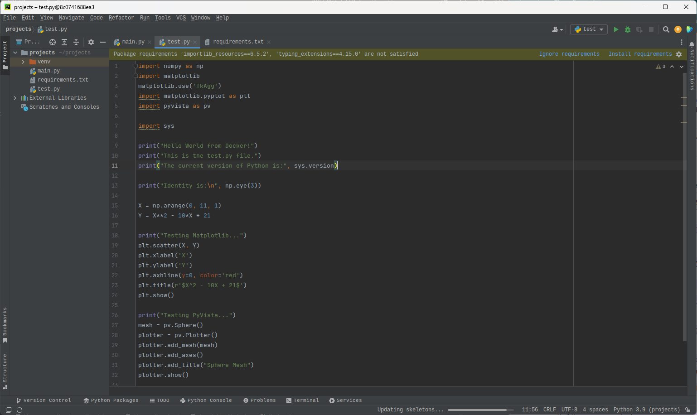

#   Running Pycharm IDE in a Docker container
Example template for running and debugging older versions of Python code with Docker.

##  To-do
- [x]  Add license

## License
This project is licensed under the Apache License, Version 2.0 - see the [LICENSE](LICENSE) file for details.

##  Dependencies
*  Working internet/WiFi connection
*  Host machine operating system: Windows 11
*  Docker container base: Ubuntu 24.04 
*  Python version: [3.9](https://www.python.org/downloads/release/python-3925/)
*  Example project repository: contains all scripts and function files of your project (e.g. under the [/projects] directory).
*  `requirements.txt`: file storing all Python modules and respective versions to create a virtual environment for your project.
*  [VcXsrv X11 server on Windows](https://sourceforge.net/projects/vcxsrv/): enables the visualisation of GUI programs, running inside the Docker container, on the host Windows machine.
*  [Docker Desktop on Windows](https://docs.docker.com/desktop/setup/install/windows-install/): build, run and share Docker containers. 
*  `Dockerfile`: file containing commands to automatically create a Docker container image with the Pycharm IDE installed.
*  `docker-compose.yml`: file that defines and runs Docker containers.

##  Instructions
1. Download a copy of this repository.
2. Download, install, and run VcXsrv on your host machine to turn on X11 forwarding. For the specific setup instructions, please refer to steps 1-3 of [this link](https://opencmiss-iron-tutorials.readthedocs.io/en/latest/faq/docker/setup_vcxsrv_x11_server_windows.html).  
3. Open `Docker Desktop.exe` and make sure that it is running in the background.
4. In a command line terminal, navigate to the directory containing `Dockerfile` and `docker-compose.yml`.
5. Run the following commands:
    * `docker compose down`: stops and removes any running Docker containers not related to your project.
    * `docker compose build --no-cache`: builds the Docker container image based on your `Dockerfile`.
    * `docker compose up`: build and create an application that uses the Docker container.
   This should load a Pycharm IDE inside the Docker container like below:
   
6. Set up, run and edit your code as you would in your local Pycharm IDE. Note that the changes made in the Docker container will sync with your local folder.  